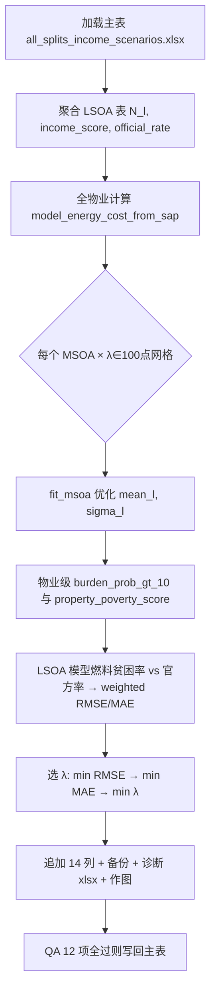

# UK 家庭燃料价格风险研究 — 项目核心总结

> 本文档梳理 Westminster 案例研究的总体研究框架、概念体系、数据与建模流水线，并对当前已实现的 **LSOA 对数正态收入分布 + SAP 能源成本** 模块做重点说明。  
> 对应脚本：`scripts/income_distribution_model.py`、`scripts/build_lsoa_income_distributions.py`（注意文件名为复数 *distributions*）。

---

## 1. 研究定位与核心论点

### 1.1 论文主题

本项目面向高水平能源/城市/住房/气候政策期刊，以 **Westminster（伦敦核心富裕区）** 为实证案例，研究 **家庭燃料价格风险（household fuel price risk）**——即家庭对未来化石燃料价格冲击的暴露、敏感性与适应能力，而非仅描述当前的燃料贫困（fuel poverty）。

### 1.2 中心论点

> **燃料贫困识别当下的困境；家庭燃料价格风险识别未来的价格冲击暴露；净零路径决定谁获得保护。**

国内净零干预（围护结构改造、清洁供热、光伏、储能、智能电价、需求侧灵活性等）应被视为 **有条件的家庭去风险工具**：它们可能降低对化石燃料价格波动的依赖，但保护效果取决于建筑围护、供热系统、产权、收入、电价结构、市场传导与低碳资产可及性，**并非自动生效**。

### 1.3 核心研究问题

**主问题：** 在何种住房、市场与治理条件下，国内净零干预能在多大程度上降低 Westminster 家庭对化石燃料价格波动的 **不平等暴露**？

三个子问题：

| 子问题 | 内容 |
|--------|------|
| **谁最暴露？** | 哪些家庭-住宅类型在气价、电价或综合燃料价格冲击下，所需能源负担上升最大？ |
| **为何暴露？** | 收入、住房成本后剩余收入、围护、供热、产权、支付方式、健康脆弱性与低碳技术可及性如何共同构成风险？ |
| **干预能否去风险？** | 围护改造、系统升级、光伏、储能、智能电价、综合净零包各带来多少风险削减，谁最可能受益？ |

---

## 2. 概念框架：三个相关但不同的概念

| 概念 | 含义 | 在本项目中的角色 |
|------|------|------------------|
| **燃料贫困（fuel poverty）** | 在当前价格与模型所需能源下，家庭是否承受可负担性困难（如 LILEE 框架） | 校准与验证指标；与官方 LSOA 燃料贫困率对照 |
| **能源负担（energy burden）** | 所需（或实际）能源成本占收入或住房成本后剩余收入的比例 | 基线与冲击情景下的核心比率指标 |
| **家庭燃料价格风险（household fuel price risk）** | 在价格冲击情景下，负担上升的幅度、尾部风险与阈值穿越概率 | 论文的主要创新概念与地图输出对象 |

工作公式：

```text
家庭燃料价格风险 = 暴露（exposure）+ 敏感性（sensitivity）− 适应能力（adaptive capacity）
```

**重要区分：** 脱碳 ≠ 去风险。电力系统脱碳可能先减排、后才降低家庭电价风险（GB 边际定价与气-电传导下的「电力脱碳缺失保险红利」）。

---

## 3. 实证策略与建模流水线

### 3.1 分析单元

首选 **物业级或家庭-住宅配对（property / household-dwelling pair）**；在缺乏家庭微观数据时，用 EPC 物业记录 + LSOA/MSOA 层级的收入与剥夺代理进行分配。

Westminster 当前主样本：**124,980 条 EPC 物业记录**，覆盖 **126 个 LSOA**、**26 个 MSOA**。

### 3.2 推荐建模流

```text
建筑存量层（EPC / LBSM）
    → 家庭或原型分配
    → 所需能源需求（SAP 等）
    → 电价与价格引擎
    → 燃料价格冲击情景
    → 干预引擎（围护 / 热泵 / 光伏 / 储能 / 智能电价等）
    → 燃料贫困、负担与风险指标
    → 空间地图与分布输出
```

### 3.3 项目阶段（当前进度）

| 阶段 | 状态 | 说明 |
|------|------|------|
| 1. 物业主表 enriched | ✅ 已完成 | `enrich_property_master.py`：邮编→LSOA、MSOA 收入、IoD 收入剥夺、官方燃料贫困率 |
| 2. LSOA 收入分布 + 基线负担/贫困分数 | ✅ 已完成 | `build_lsoa_income_distributions.py` + `income_distribution_model.py` |
| 3. 价格冲击情景引擎 | 🔲 待建 | 气价/电价/综合冲击、standing charge、社会电价等 |
| 4. Household Fuel Price-at-Risk 等指标 | 🔲 待建 | 基于收入分布与冲击后负担的尾部风险 |
| 5. 干预情景模拟 | 🔲 待建 | 围护、清洁热、光伏、储能、综合包等 |
| 6. 空间与分布输出 | 🔲 待建 | LSOA/MSOA 地图、产权/EPC/遗产约束分层 |

---

## 4. 数据资产

核心主文件：`data/all_splits_income_scenarios.xlsx`（约 200 MB，**运行后原地追加列**）。

| 数据源 | 文件 | 用途 |
|--------|------|------|
| EPC 物业主表 | `all_splits_income_scenarios.xlsx` | 地址、UPRN、SAP、面积、供热、坐标、MSOA 等 |
| 邮编查找 | `PCD_OA21_LSOA21_MSOA21_LAD_FEB25_UK_LU.csv` | 邮编 → LSOA 2021 |
| ONS 小域收入 | `datasetfinal.xlsx` | MSOA「住房成本后可支配收入」 |
| IoD 2025 | `File_7_IoD2025_...csv` | LSOA `Income Score (rate)` 作低收入尾部代理 |
| 官方燃料贫困 | `fuel-poverty-sub-regional-2026-2024-data-tables.xlsx` Table 4 | LSOA 燃料贫困比例（**用于 λ 选择，非优化直接输入**） |

详细数据说明见项目根目录 `AGENTS.md`。

---

## 5. 当前已实现模块：LSOA 对数正态收入分布

本节对应您指定的两个脚本，是后续 **能源负担** 与 **Household Fuel Price-at-Risk** 的 **收入引擎**。

### 5.1 模块目标

对每个 LSOA 估计参数化收入分布：

```text
Y_l ~ Lognormal(μ_l, σ_l²)
```

使其与三类公开信息一致：

1. **MSOA 官方数据**：住房成本后可支配年收入（`Disposable annual income after housing costs`）；
2. **LSOA IoD 2025**：`Income Score (rate)`，作为低收入尾部软目标；
3. **LSOA 官方燃料贫困率**：用于在每个 MSOA 上 **选择正则化参数 λ**，不直接进入优化目标。

拟合完成后，在物业级计算 **SAP 反推的所需能源成本** 与 **10% 负担阈值下的贫困概率分数**，并聚合为 LSOA 模型燃料贫困率，与官方率比较以选 λ。

### 5.2 脚本分工

```
scripts/
├── income_distribution_model.py      # 数学核心：优化、SAP 成本、对数正态 CDF
└── build_lsoa_income_distributions.py  # 流水线：读主表、λ 网格、写回主表、诊断与作图
```

上游依赖：`scripts/enrich_property_master.py`（提供输入列）。

#### `income_distribution_model.py` — 模型层

**职责：** 封装常数、目标函数、单 MSOA 优化、SAP 能源成本正反演。

| 组件 | 功能 |
|------|------|
| `POVERTY_LINE = 19009` | 贫困线（英镑，住房成本后收入），用于 `P(Y < 19009)` |
| `SIGMA_BOUNDS = (0.10, 1.4)` | σ 搜索范围（2026-05 放宽，避免大量 LSOA 顶在旧上界 0.9） |
| `MEAN_BOUNDS_FACTOR = (0.6, 1.6)` | 各 LSOA 均值相对 MSOA 收入的倍数界 |
| `compute_terms()` | 分解 MSOA 锚定项与 LSOA 尾部项（不含 λ） |
| `fit_msoa()` | 对给定 λ，多 σ 种子 + L-BFGS-B，失败则 SLSQP |
| `model_energy_cost_from_sap()` | 由 SAP 与 `TOTAL_FLOOR_AREA` 反推所需模型能源成本 |
| `reconstruct_sap()` | QA：由模型成本还原 SAP |

**参数化（均值参数化，保证 E[Y]=mean_income）：**

```text
μ_l = ln(mean_income_l) − 0.5 · σ_l²
```

**优化目标（Plan A：LSOA 项按物业数加权）：**

```text
obj_m(λ) =
  ( ln( Σ_l N_l · mean_l / Σ_l N_l ) − ln(msoa_income_m) )²
+ λ · Σ_l (N_l / Σ_l N_l) · ( P(Y_l < 19009) − income_score_l )²
```

- `N_l`：该 LSOA 内 EPC 物业条数；
- `income_score_l`：IoD Income Score；
- `P(Y_l < 19009)`：对数正态在贫困线下的概率（正态 CDF 于对数尺度）。

**SAP 所需能源成本（与 λ 无关）：**

```text
ECF = (100 − SAP) / 16.21           若 SAP ≥ 43.265
ECF = 10^((108.8 − SAP) / 120.5)    否则

model_energy_cost = ECF × (TOTAL_FLOOR_AREA + 45) / D_PARAM
D_PARAM = 0.2
```

#### `build_lsoa_income_distributions.py` — 流水线层

**职责：** 端到端运行、λ 选择、主表写回、诊断工作簿与 PNG。

**流程概览：**



**λ 网格：** `np.geomspace(1e-4, 1e-1, 100)`（对数间隔，低端分辨率更细）。

**λ 选择规则（每个 MSOA 独立）：**

```text
selected_λ_m = argmin_λ ( weighted_RMSE_m , weighted_MAE_m , λ )
```

**物业级负担与贫困分数（在选定 λ 下）：**

```text
burden_prob_gt_10 = P( Y_l < model_energy_cost / 0.10 )

property_poverty_score = 0                    若 SAP_grade ∈ {A, B, C}
                     = burden_prob_gt_10      否则

modeled_lsoa_poverty_rate_l = mean(property_poverty_score | LSOA = l)
```

A/B/C 等级物业强制贫困分为 0：在当前成本模型下，极高能效住宅在构造上难以使家庭超过 10% 负担阈值。

### 5.3 主表新增列（14 列）

| 列名 | 含义 |
|------|------|
| `selected_lambda` | 该物业所在 MSOA 选定的 λ |
| `lsoa_property_count` | LSOA 物业数 N_l |
| `lsoa_lognormal_mean_income` | E[Y_l] |
| `lsoa_lognormal_mu` | μ_l |
| `lsoa_lognormal_sigma` | σ_l |
| `lsoa_tail_prob_under_19009` | P(Y_l < 19009) |
| `lsoa_income_score_target` | IoD Income Score |
| `model_energy_cost_from_sap` | SAP 反推所需能源成本 |
| `burden_prob_gt_10` | P(成本/收入 > 10%) |
| `property_poverty_score` | 物业贫困概率分数 |
| `modeled_lsoa_poverty_rate` | LSOA 模型燃料贫困率 |
| `official_lsoa_poverty_rate` | 官方 LSOA 燃料贫困率 |
| `lsoa_poverty_rate_error` | 模型 − 官方 |
| `msoa_lambda_weighted_rmse` | 该 MSOA 在选定 λ 下的加权 RMSE |

### 5.4 运行方式与产出

```powershell
cd "D:\Documents\2025\Research\Journal\third paper\UK household risk"
python -W ignore::DeprecationWarning scripts/build_lsoa_income_distributions.py
```

| 产出 | 路径 |
|------|------|
| 主表备份 | `data/backups/all_splits_income_scenarios_<timestamp>.xlsx` |
| 更新后主表 | `data/all_splits_income_scenarios.xlsx` |
| 诊断工作簿 | `outputs/lsoa_income_distribution_results_<timestamp>.xlsx` |
| λ–误差总览图 | `outputs/msoa_error_overview_vs_lambda_<timestamp>.png` |
| LSOA 误差–λ 分面图 | `outputs/lsoa_error_vs_lambda_fig*_of_*_<timestamp>.png` |
| LSOA 收入 PDF 图 | `outputs/lsoa_income_pdf_fig*_of_*_<timestamp>.png` |

端到端约 **7–8 分钟**（主要耗时在读写大 Excel）；优化本身约 26×100 = **2,600** 次 MSOA 拟合，通常一分钟内完成。

### 5.5 质量检查（12 项，任一失败则中止写回）

代表性检查包括：行数不变、λ/σ/均值界、多 LSOA 的 MSOA 内尾部概率差异 ≥ 0.005、概率列 ∈ [0,1]、ABC 等级贫困分为 0、模型能源成本为正、SAP 重建误差可接受等。

### 5.6 当前实证结果摘要（最近验证运行：20260520_213323）

| 指标 | 数值 |
|------|------|
| 物业数 / LSOA / MSOA | 124,980 / 126 / 26 |
| QA | 12/12 通过（QA#5 已改为「MSOA 内 tail_prob 极差」） |
| mean_l / msoa_income | 0.99965 – 1.00031（均值几乎锚定在 MSOA 均值） |
| σ_l 范围 | 0.419 – 1.400（仅 3/126 顶在上界） |
| MSOA 加权 RMSE（均值/最大） | 0.049 / 0.120（单 LSOA MSOA E02000124 最大） |
| 模型 vs 官方燃料贫困率误差（均值） | −0.017（系统性略低于官方） |
| 选定 λ 范围 | 1e-4 – 7.05e-2 |

**解释要点：** 放宽 σ 上界后，优化器主要通过 **σ_l（收入离散度）** 区分 LSOA，而非移动均值；同一 MSOA 内 LSOA 共享 MSOA 平均收入、但尾部概率不同。Income Score 与官方燃料贫困率在概念上并不相同，故残余误差 0.03–0.10 属预期范围。

更细的方法论、局限与 Plan B/C 扩展见：`materials/LSOA_income_distribution_methodology.md`。

---

## 6. 关键指标（全文计划）

当前模块已支撑 **基线能源负担** 的概率化表述；完整风险框架尚待价格冲击与干预层。

| 指标 | 定义（概念） | 当前状态 |
|------|----------------|----------|
| 基线能源负担 | 所需年能源成本 / 住房成本后剩余收入 | 部分：10% 阈值穿越概率 |
| 冲击后能源负担 | 价格冲击下成本 / 剩余收入 | 待建 |
| 风险抬升（risk uplift） | 冲击负担 − 基线负担 | 待建 |
| Household Fuel Price-at-Risk | 多情景下负担的高分位 | 待建 |
| 阈值穿越风险 | P(负担 > 6%/10%/15%/20%) | 基线 10% 已实现 |
| 去风险红利（de-risking dividend） | 干预前后 Fuel Price-at-Risk 之差 | 待建 |

计划价格冲击情景包括：温和/严重/极端气价冲击、电价冲击、气-电传导（低/中/高）、standing charge 冲击、社会电价/账单支持等（见 `AGENTS.md`）。

---

## 7. 干预情景（规划）

最低干预集（物业/原型 **干预前后** 对比）：

1. 基线（无干预）  
2. 轻型围护（防风、阁楼、基础控制）  
3. 中型围护（空腔、地面、部分立面）  
4. 深度围护（实墙、高性能窗，含遗产约束）  
5. 系统升级 / 清洁热（热泵等，需检验气-电价比与 COP）  
6. 仅光伏  
7. 光伏 + 储能  
8. 智能电价 / 灵活性  
9. 综合净零包  
10. 政策支持层（WHDS、社会电价、standing charge 改革等）

论文最有原创性的输出预期为 **去风险缺口地图**：风险保护最需要的地区 vs 低碳干预在技术、财务与制度上可及的地区。

---

## 8. Westminster 案例机制（简述）

| 机制 | 与风险的关系 |
|------|----------------|
| 高住房成本 | 压低剩余收入 → 提高对能源价格冲击的敏感性 |
| 大比例私人租赁 | 房东-租户激励分裂，租户难以主导改造 |
| 社会住房项目 | 有计划改造机会，亦可能存在相对 PRS/leasehold 的保护缺口 |
| 公寓、HMO、leasehold 组团 | 个体光伏/热泵/储能可及性受限 |
| 战前实墙、挂牌与保护区建筑 | 改造复杂昂贵，遗产约束成为能源脆弱性机制 |
| 区域供热 | 风险转移至基础设施治理与资费设计 |
| 高平均财富 | 掩盖住房成本后贫困、欠热与燃料价格风险的空间集聚 |

---

## 9. 代码与文档地图

```text
项目根/
├── AGENTS.md                              # 项目使命、数据地图、工作流（Codex–Cursor）
├── materials/
│   ├── 项目核心研究总结.md                 # 本文档
│   ├── LSOA_income_distribution_methodology.md  # 收入分布模块详细说明
│   ├── UK_Household_Fuel_Risk_Research_Mainline.md
│   ├── Westminster_Fuel_Risk_RQ_Contribution_Methodology.md
│   └── DP1.md … DP8.md                    # 分主题设计备忘录
├── scripts/
│   ├── enrich_property_master.py
│   ├── income_distribution_model.py       # ★ 模型核心
│   ├── build_lsoa_income_distributions.py # ★ 流水线（注意复数）
│   └── remove_invalid_postcode_properties.py
├── data/                                  # 原始与主表（运行后 enriched）
└── outputs/                               # 诊断与图（不纳入 git）
```

---

## 10. 下一步工作（研究 + 技术）

### 10.1 模型扩展（收入引擎）

- **Plan B：** 在 LSOA 项中直接对齐 `official_lsoa_poverty_rate`，使 λ 在 MSOA 均值与「我们真正关心的燃料贫困率」之间权衡。  
- **Plan C：** 为 `mean_l` 增加与 `(1 − income_score_l)` 的软先验，使剥夺结构性驱动 LSOA 均值差异。

### 10.2 主建模链

1. 构建 **价格冲击情景引擎**（气/电/综合、传导、standing charge、政策缓释）。  
2. 在现有 `burden_prob_gt_10` 逻辑上扩展多阈值与 **Household Fuel Price-at-Risk**。  
3. 实现 **干预包** 对 SAP/需求/燃料结构的改造，计算 **去风险红利**。  
4. 按 LSOA、产权、EPC、供热系统、遗产约束等产出 **空间与分布图**。

### 10.3 写作贡献（四线）

1. **概念：** 将家庭燃料价格风险定义为燃料贫困与能源脆弱性的 **事前、情景化** 延伸。  
2. **方法：** 在物业/LSOA 尺度操作化 Fuel Price-at-Risk、阈值穿越、可负担性缺口-at-risk、去风险红利。  
3. **实证：** Westminster 隐藏脆弱性与不平等低碳保护的案例证据。  
4. **政策：** 将国内净零重新框定为 **分配性家庭风险保护议程**，并强调靶向、市场改革、产权治理与本地交付。

---

## 11. 参考文献档索引

| 文档 | 何时阅读 |
|------|----------|
| `AGENTS.md` | 项目总览、数据文件、Git 与工作流 |
| `materials/LSOA_income_distribution_methodology.md` | λ 网格、QA、运行状态、Plan B/C |
| `materials/DP2.md` | 燃料贫困 vs 价格风险 vs 负担 |
| `materials/DP4.md` | 气-电传导、边际定价、电气化风险 |
| `materials/DP6.md` | 方法设计、指标、地图与局限 |
| `materials/Westminster_Fuel_Risk_RQ_Contribution_Methodology.md` | Westminster RQ、贡献与论文结构 |

---

*文档生成说明：基于 `AGENTS.md`、`materials/LSOA_income_distribution_methodology.md` 及 `scripts/income_distribution_model.py`、`scripts/build_lsoa_income_distributions.py` 源码整理。用户提及的 `build_lsoa_income_distribution.py`（单数）在仓库中不存在，实际文件为 `build_lsoa_income_distributions.py`。*
